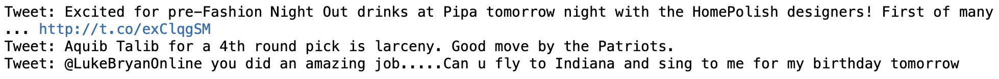
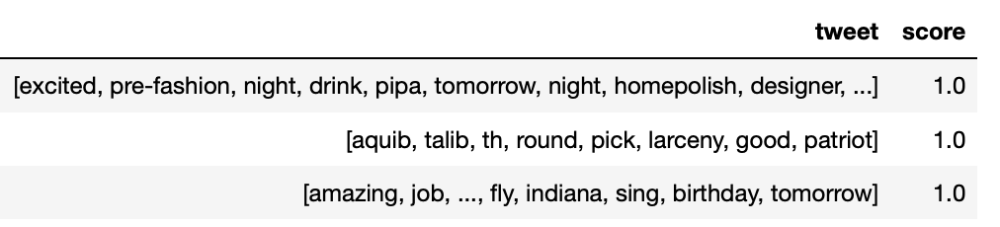
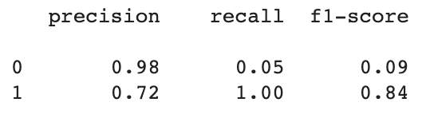
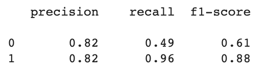
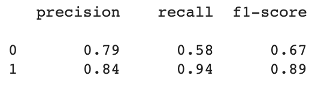
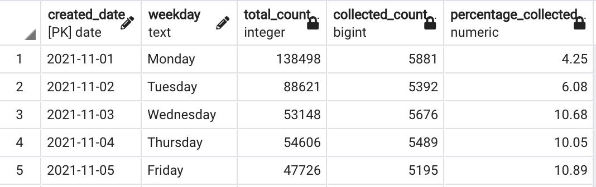

# Twitter-Sentiment-Analysis
A weekday Twitter sentiment analysis on Tesla

## Project Overview
The purpose of this project was to create a Twitter sentiment monitoring dashboard. By applying NLP, a dataset of over 40K pre-labeled tweets classified into positive, negative, and neutral was used to train and test different machine learning models. New tweets were collected via the Twitter API v2 and passed into the selected model to predict sentiment. The dashboard presents analysis of sentiment by weekday where chosen topic was Tesla.

### Resources
- Data Source: [SemEval-2017 Twitter data](https://alt.qcri.org/semeval2017/task4/) and Twitter API v2
- Language: 
    - Python, PySpark
        - Dependecies: numpy, pandas, nltk, matplotlib, re, scikit-learn
    - JavaScript, HTML, CSS
        - Libraries: Bootstrap, D3, plotly, anychart
- Software: Jupyter Notebook, VSCode, Google Colab, pgAdmin, AWS
- Code/Notebooks:
    - [Data Cleaning](Preprocessing/Final_Data_Cleaning.ipynb)
    - [Machine Learning](Modeling/Modeling_InitialData.ipynb)
    - [Twitter API data gathering](API/Twitter_V2_API_Call_Final_with_Looping.ipynb)
    - [Cleaning and Scoring API data](API/clean_score_tweets.ipynb)
    - [Database ETL](Database/ETL.ipynb)
    - [JavaScript](Visualization/js)
    - [HTML](index.html)
- **[Link to interactive dashboard](https://weihaolun.github.io/Twitter-Sentiment-Analysis/)**
- **[Link to slides](https://docs.google.com/presentation/d/1SkkuV-xCmLAFttBB86dk_F36QMiQGmegqGKszvBal8w/edit#slide=id.g1026bbf1345_7_260)**

## Method

### A. Data Gathering
1. SemEval Dataset - The dataset contains tweets categorized to into three labels: positive, negative, and neutral. This data gathered was a result of an international workshop on semantic evaluation (SemEval) focusing on message polarity classification.
2. API Tweets 
- New tweets were collected via **Standard Basic Twitter API v2**. 
- Endpoints used were **search tweets** and **tweet counts** in which one can retrieve public tweets posted and count of tweets for a query over the last 7 days. 
- Data gathered was from Nov. 1-14, 2021 (two weeks). Total tweets is 67,200 (200 tweets per hour).

### B. Data Cleaning
- A function was created to clean the tweets using regular expression to remove retweets, hyperlinks, hashtags, numbers, emojis, and mentions. NLP was applied by tokenizing the tweets, removing stop words, and lemmatizing the list of words by utilizing the NLTK library.
- A second function was created to apply the cleaning function, build the dataframe, and assign scores (1:positive, 0:neutral, -1:negative) to each tweet accordingly. 

    
    <h5 align="center">Tweets Before Cleaning</h5>

    
    <h5 align="center">Tweets After Cleaning</h5>

### C. Machine Learning
- Preprocessing of data: Using a .py file, the cleaning function was applied on the newly downloaded tweets from the Twitter API to be able to feed it to the model for sentiment prediction.
- Modeling: Three algorithms were tested and compared to see which model performed best. As part of the optimization, the neutral tweets were dropped to improve the model scores. Based on the results, model selected was LinearSVC with accuracy score of 0.83.

| Model | Accuracy Score | Precision - Recall - F1 Score
| ------------- | :-------------: | ------------- |
| Bernoulli Naive Bayes | 0.72 | 
| Logistic Regression | 0.82 | 
| Linear Support Vector Classification | 0.83 | 

### D. Database
- An AWS RDS instance was created and connected to pgAdmin where a new database was created. 
- Tables were generated using a [schema](Database/db_schema.sql).
- Data files were uploaded to an S3 bucket where PySpark was used to extract and transform the data to match the tables in pgAdmin (see [ETL process](Database/ETL.ipynb)).
- Connection was made to the AWS RDS instance to write the dataframes created to the tables in the RDS. 

    
    <h5 align="center">Sample Join Query Result</h5>

### E. Interactive App/Dashboard
#### Filter By Week
    - Date range of the week
    - Total tweets occurred @tesla
    - Average tweets occurred per day
    - Tweets occurred per weekday
#### Filter By Weekday
    - Accumulated weekday tweets
    - Number of weeks so far
    - Overall sentiment distribution 
    - Positive rate
    - Five positive tweets and five negative tweets
    - Top 10 keywords
    - Top 100 keywords cloud
    - Line chart of sentiment distribution by hour
#### Dashboard Showcase
https://user-images.githubusercontent.com/84211948/142153107-37329f51-10f5-4a17-9946-c13dd3862d96.mp4

## References

- Rosenthal, S. et al. (n.d.). *SemEval-2017 Task 4*. ALT QCRI. https://alt.qcri.org/semeval2017/task4/

- Edward, A. (2021, June 13). *An Extensive Guide to collecting tweets from Twitter API v2 for academic research using Python 3*. Towards Data Science. https://towardsdatascience.com/an-extensive-guide-to-collecting-tweets-from-twitter-api-v2-for-academic-research-using-python-3-518fcb71df2a

- Goyal, G.(2021, June 11). *Twitter Sentiment Analysis- A NLP Use-Case for Beginners*. Analytics Vidhya. https://www.analyticsvidhya.com/blog/2021/06/twitter-sentiment-analysis-a-nlp-use-case-for-beginners/

- Effrosynidis, D. (2019). *text-preprocessing-techniques*. Github. https://github.com/Deffro/text-preprocessing-techniques

Other useful articles:
- https://developer.twitter.com/en/docs/twitter-api/early-access 

